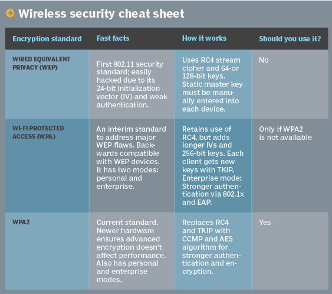

# Wireless Hacking Intro Lab 

# Introduction #
Remember to always have permission for attempting these exercises. See the instructor for which networks to target. In addition, your classmates may interfere with your own progress through this lab. Be patient. Ask for clarification.

## Software Installation ##
Please have `aircrack-ng` installed on your machine. 

For Ubuntu, use:
```
sudo apt install aircrack-ng
```

For Arch Linux, use:
```
sudo pacman -S aircrack-ng
```

Kali Linux most likely has it already installed.

For others, good luck :-) 

** Note: Not all wireless adapters are able to perform this lab. **
To check if your device can perform this lab, type:
```
sudo airmon-ng
```

This will give a list of devices and the driver associated with it. If you have any intel device, it will not work. If you have `ath9k` as the driver, it most likely will work. If you are interested in getting serious with wireless hacking, buy an adapter that is specifically stated to work well with `aircrack-ng`.

To hack WPA2, we need to use a dictionary attack. In this case, use the dictionary found in this repository. It has been modified to include the WPA2 password. Download the [wordlist](./wordlist.txt).

## WEP ##
WEP stands for Wired Equivalent Privacy. Uses a shared key to encrypt traffic between an access point (AP) and a client. We will not be going in depth about the protocal itself, but instead we will be getting the shared key a connection to it.

What you really need to know about this protocal, is that is really outdated and insecure. While WPA2 hasn't faired well recently (search for KRACK attack), WEP is even worse. 

## WPA/WPA2 ##

WPA was created to fix the numerous flaws with WEP. It was not meant to be a permanent fix, just a temporary one. In addition, it was meant to be backward compatable with WEP to help the standard get adopted quickly.

Then, WPA2 was released. WPA2 replaces the ciphers used in WEP/WPA. It also inctroduced more features like seamless romaing. But it is vulnerable to brute force attacks.


## Comparison of Networks ##


[Picture Source](https://searchnetworking.techtarget.com/feature/Wireless-encryption-basics-Understanding-WEP-WPA-and-WPA2)

# Exercises #

## Setup ## 
### Router ###

This lab is using a router that has been uploaded with a custom firmware called [OpenWRT](https://openwrt.org/). This is a Linux operating system that can give your router more features, but also frees your dependence on companies providing support. 

For this lab, the configuration is located elsewhere in the repository. You can upload this backup to another router to reproduce this lab. 

## Network Reconnaissance ##

First, we have to find out information about our target networks. To do this, we have to set our wireless interface into monitor mode:

```
# airmon-ng stop <interface>
# airmon-ng start <interface>
# iwconfig
# airodump <monitor interface>
```

This will be scanning the networks around. You will eventually see our networks (`HackMePlease` and `HackMePorFavor`) appear. When this occurs, take note of the channel and the BSSID MAC Address. We will need this information later and the following tutorials do not cover it well.

## Hacking WEP ## 

We need to collect Initialization Vectors (IV) to be able to crack a WEP network. Initialization Vectors are "fixed-size input to a cryptographic primitive that is typically required to be random or pseudorandom." [Wiki Link](https://en.wikipedia.org/wiki/Initialization_vector) The reason this is important is found in the same article:

> The 802.11 encryption algorithm called WEP (short for Wired Equivalent Privacy) used a short, 24-bit IV, leading to reused IVs with the same key, which led to it being easily cracked. Packet injection allowed for WEP to be cracked in times as short as several seconds. This ultimately led to the deprecation of WEP.

To crack WEP, follow the material from [Here](https://www.aircrack-ng.org/doku.php?id=simple_wep_crack). It is the aircrack-ng wiki that is fairly comprehensive. Let the instructor know if there are any questions.

Your wireless card may not work for this. If not, we will perform this in class, or pair up with people.


## Hacking WPA2 ##

To crack WPA2, follow the material from [Here]](https://www.aircrack-ng.org/doku.php?id=cracking_wpa). Let the instructor know if there are any questions.

# Sources #
[TechTarget](https://searchnetworking.techtarget.com/feature/Wireless-encryption-basics-Understanding-WEP-WPA-and-WPA2)

[WEP Crack](https://www.aircrack-ng.org/doku.php?id=simple_wep_crack)

[WPA Crack](https://www.aircrack-ng.org/doku.php?id=cracking_wpa)

[Newbie Article](https://www.aircrack-ng.org/doku.php?id=newbie_guide)

[WEP Details](http://www.opus1.com/www/whitepapers/whatswrongwithwep.pdf)
